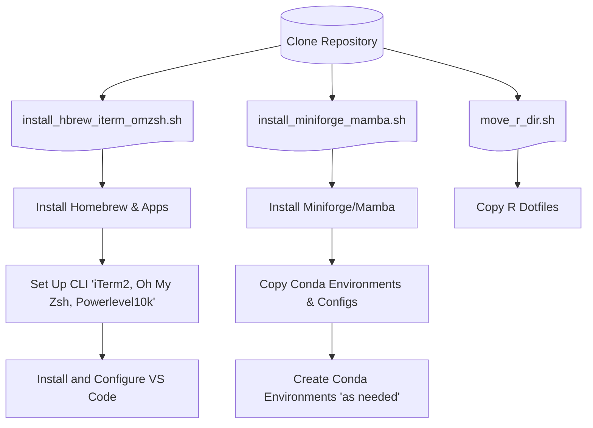

# fresh_setup

   

A repository automating the fresh setup of a new macOS computer or the refresh of an existing system, using streamlined bash scripts. It installs and configures Homebrew, essential applications, and enhances the CLI with iTerm2, custom themes, and Oh My Zsh. Conda/mamba environments and configuration files are deployed to support computational and bioinformatic work. Visual Studio Code is set up as the coding environment with key extensions and configurations for shell, Python, and R. Clone this repo to quickly bootstrap or refresh your machine with your preferred tools, dotfiles, and workspace settings.

---

## Table of Contents

- [fresh\_setup](#fresh_setup)
  - [Table of Contents](#table-of-contents)
  - [Requirements/Dependencies](#requirementsdependencies)
  - [Installation Overview](#installation-overview)
  - [Quick Start](#quick-start)
    - [Uninstallation / Cleanup](#uninstallation--cleanup)
  - [Workflow \& Directory Breakdown](#workflow--directory-breakdown)
    - [Directory Structure](#directory-structure)
    - [Simple Workflow Overview](#simple-workflow-overview)
  - [Detailed Component Guide](#detailed-component-guide)
    - [Homebrew \& CLI Setup (`hbrew_ohmyzsh/`)](#homebrew--cli-setup-hbrew_ohmyzsh)
      - [Core Features - Homebrew \& CLI Setup](#core-features---homebrew--cli-setup)
      - [CLI Options](#cli-options)
      - [Installed Applications \& Tools](#installed-applications--tools)
      - [Oh My ZSH Plugins Installed](#oh-my-zsh-plugins-installed)
    - [Complete Uninstaller of Homebrew \& CLI Setup](#complete-uninstaller-of-homebrew--cli-setup)
      - [Reverses homebrew and CLI setup by](#reverses-homebrew-and-cli-setup-by)
      - [CLI Options Uninstaller of Homebrew \& CLI Setup](#cli-options-uninstaller-of-homebrew--cli-setup)
    - [Package/environment management via conda/mamba (`mamba/`)](#packageenvironment-management-via-condamamba-mamba)
      - [Core Features of installation](#core-features-of-installation)
      - [CLI Options for script](#cli-options-for-script)
      - [Conda Environments (`environments/`)](#conda-environments-environments)
      - [R Base Environment (`environments/R/base/`)](#r-base-environment-environmentsrbase)
      - [Genomics Environments (`environments/genomics/`)](#genomics-environments-environmentsgenomics)
      - [Workflow Environment (`environments/snakemake/`)](#workflow-environment-environmentssnakemake)
    - [Complete Uninstaller of Anaconda related instances](#complete-uninstaller-of-anaconda-related-instances)
      - [Advanced uninstaller that removes](#advanced-uninstaller-that-removes)
    - [R template files (`R/`)](#r-template-files-r)
      - [Core Features - R template files](#core-features---r-template-files)
      - [R Configuration Files](#r-configuration-files)
      - [CLI Options R template files](#cli-options-r-template-files)
  - [General script Features](#general-script-features)
    - [Logging \& Debugging](#logging--debugging)
    - [Error Handling \& Recovery](#error-handling--recovery)
      - [Robust Error Management](#robust-error-management)
      - [Common Issues](#common-issues)
    - [Architecture \& Design](#architecture--design)
      - [Script Design Principles](#script-design-principles)
      - [Security Features](#security-features)
    - [Advanced Usage Examples](#advanced-usage-examples)
      - [Dry Run Mode](#dry-run-mode)
      - [Force Mode](#force-mode)
      - [Custom Paths](#custom-paths)
  - [Used software overview](#used-software-overview)
  - [Contributing \& License](#contributing--license)

---

## Requirements/Dependencies

- **macOS** (Intel or Apple Silicon)
- **Git** installed (usually preinstalled with macOS as versions *2.30.x to 2.39.x*)
- Administrative (**sudo**) access

---

## Installation Overview

1. **Clone** the repository  
2. **Homebrew & Programs/Apps**: Install Homebrew and various essential programs via Homebrew. These include alt-tab, discord, raycast, rectangle, spotify, zoom, google chrome, and various fonts.
3. **CLI setup**: Install iTerm2, Powerlevel10k theme, and color schemes, as well as Oh My Zsh and associated applications, to configure an enhanced command line interface.
4. **Coding environment**: Install and configure the Visual Studio Code (VS Code) code editor and useful extensions to setup a coding environment.
5. **Miniforge/Mamba**: Install package/environment manager conda/mamba from the miniforge repository. Initial configuration.
6. **Conda Environments & RC files**: Copy environment directory into home `fresh_setup/environments/` ---> `~/environments/`. This directory contains custom YAMLs for several custom computational environments and optionally create them. Copy rc files for mamba/conda configuration into `fresh_setup/mamba/` ---> `~/`.
7. **R template files**: Copy R dotfiles (.lintr and .Rprofile) into `fresh_setup/R/r_files/` ---> `~/`

---

## Quick Start

1. **Clone the repo**

```bash

git clone https://github.com/mo-morando/fresh_setup.git ~/fresh_setup
cd ~/fresh_setup

```

2. **Make scripts executable:**

```bash
   find . -name "*.sh" -exec chmod +x {} \;
```

3. **Run the setup scripts in order:**

```bash
   # Terminal and development tools
   ./hbrew_ohmyzsh/install_hbrew_iterm_omzsh.sh
   
   # Python/Conda environment
   ./mamba/install_miniforge_mamba.sh
   
   # R development environment
   ./R/move_r_dir.sh
   
```

4. **After YAMLs are moved, create environments**

```bash

conda env create -f ~/environments/<env_name>.yml

```

### Uninstallation / Cleanup

- **Homebrew & Zsh**

```bash

./hbrew_ohmyzsh/uninstall_hbrew_iterm_omzsh.sh

```

- **Miniforge/Mamba**  

```bash

./mamba/uninstall_miniforge_mamba.sh

```

- **R Directory**  
Manually remove R dotfiles from `~/`.

---

## Workflow & Directory Breakdown

### Directory Structure

```ASCII
fresh_setup/
├── environments/                     # Conda environment definitions
│   ├── R/base/                       # Base R environment
│   ├── cert_courses/                 # Course-specific environments
│   └── snakemake/                    # Snakemake workflow environment
├── hbrew_ohmyzsh/                    # Terminal and package management
│   ├── Brewfile                      # Homebrew package definitions
│   └── install_hbrew_iterm_omzsh.sh  # Terminal setup script
├── mamba/                            # Python package management
│   ├── .condarc                      # Conda configuration
│   ├── .mambarc                      # Mamba configuration
│   ├── install_miniforge_mamba.sh    # Miniforge installer
│   └── uninstall_miniforge_mamba.sh  # Complete uninstaller
├── R/                                # R development environment
│   ├── move_r_dir.sh                 # R directory setup and synchronization
│   └── r_files/                      # Curated R configuration files
│       ├── .Rprofile                 # R startup configuration
│       └── .lintr                    # R linting configuration
├── .gitignore                        # Git ignore rules
└── README.md                         # Overview of repo
```

### Simple Workflow Overview



---

## Detailed Component Guide

### Homebrew \& CLI Setup (`hbrew_ohmyzsh/`)

**Script:** `install_hbrew_iterm_omzsh.sh`

- **Brewfile** Specifies Homebrew packages, casks, and taps, to be installed.

#### Core Features - Homebrew & CLI Setup

  1. Homebrew installation (if missing)
  2. Installation of packages and casks via predefined Brewfile
  3. iTerm2 download and setup
  4. Oh My Zsh download, installation and theme/plugins configuration  

#### CLI Options

```bash
./install_hbrew_iterm_omzsh.sh [--brewfile <path>] [--colors <dir>] [--fonts <dir>] [--help|-h]
```

#### Installed Applications & Tools

- **Development**: `git`, `gh`, `nano`, `wget`, `tree`, `htop`
- **Terminal**: iTerm2, `bash`, `bat`, `fzf`, `parallel`
- **VS Code Extensions**: Python, R, Jupyter, Git integration
- **Applications**: Chrome, Discord, Rectangle, Raycast, Spotify

#### Oh My ZSH Plugins Installed

- `zsh-autosuggestions`: Command completion
- `zsh-syntax-highlighting`: Syntax highlighting
- `zsh-history-substring-search`: Enhanced history search

### Complete Uninstaller of Homebrew & CLI Setup

**Script:** `uninstall_hbrew_iterm_omzsh.sh`

#### Reverses homebrew and CLI setup by

  1. Backing up current `Brewfile`  
  2. Uninstalling listed formulas & casks  
  3. Removing Oh My Zsh and iTerm 2
  4. Removing configurations  

#### CLI Options Uninstaller of Homebrew & CLI Setup

```bash
./uninstall_hbrew_iterm_omzsh.sh [--keep-fonts ] [--help|-h] [--dry-run] [--force]
```

### Package/environment management via conda/mamba (`mamba/`)

**Script:** `install_miniforge_mamba.sh`

#### Core Features of installation

  1. Downloads Miniforge (a minimal installer) and installs conda/mamba
  2. Moves rc files `.condarc` / `.mambarc` for preferred channels and settings for conda/mamba optimized for conda-forge
  3. Moves environments directory `environments/` from `mamba/` to `~/` for future `conda env create`

#### CLI Options for script

```bash
./install_miniforge_mamba.sh [--install-path <path>] [--no-init] [--keep-installer] [--dry-run] [--force] [--help|-h]
```

#### Conda Environments (`environments/`)

Preconfigured environments for different use cases:

#### R Base Environment (`environments/R/base/`)

- My base R environment
- Tidyverse
- Snakemake for workflow creation/management
- Compatitable with VS Code

> **Note:** to properly run R on VS Code to get full advantage of its features and get a similar experience to RStudio, several steps are required. Some of these steps require these packages. There are many great videos that explain how to accomplish this.

```yaml
name: renv
dependencies:
  - r-essentials      # R base + tidyverse
  - r-patchwork       # Plot composition
  - r-roxygen2        # Documentation
  - r-languageserver  # LSP support
  - r-rmarkdown       # Document generation
  - r-httpgd          # HTTP graphics device
  - radian            # Enhanced R console
  - snakemake         # Workflow management
```

#### Genomics Environments (`environments/genomics/`)

- **Advanced Bioconductor**: Specialized bioinformatics packages
- **Data Analysis Genomics**: Genomics-focused tools
- **Statistics & Visualizatoin**: Statistical computing and complex visualization packages

#### Workflow Environment (`environments/snakemake/`)

Dedicated environment for Snakemake workflow management

### Complete Uninstaller of Anaconda related instances

**Script** `uninstall_miniforge_mamba.sh`

#### Advanced uninstaller that removes

1. All Anaconda/Miniconda/Miniforge installations
2. Configuration files and caches
3. Shell modifications and environment variables
4. System receipts and Python packages

> **Note** This removes much more than `uninstall_miniforge_mamba.sh` install. This is a complete wipe of all Anaconda/Miniconda/Miniforge related instances. This is useful however when the current installation is problematic and full removal is suggested periodically.

### R template files (`R/`)

**Script:** `move_r_dir.sh`

#### Core Features - R template files

1. Safely moves R dotfiles to home directory
2. Safe to run multiple times
3. File count validation and integrity checks

#### R Configuration Files

- **`.Rprofile`**: Template file with custom startup message with project context
- **`.lintr`**: Linting rules with 120-character line length, snake_case style

#### CLI Options R template files

```bash
./R/move_r_dir.sh [--dry-run] [--force] [-h|--help]
```

---

## General script Features

Each script had some general features found across most scripts:

- Source directory validation
- Full path usage
- Backup creation with timestamps
- Post-installation verification
- Thorough documentation
- Color coded CL messages to provide status
- Comprehensive testing

### Logging & Debugging

Each script creates detailed logs:

- **Terminal Setup**: `~/terminal_setup.log`
- **Terminal Uninstall**: `~/terminal_uninstall.log`
- **Mamba Installation**: `~/mamba_install.log`
- **Mamba Unnstallation**: `~/miniforge_uninstall.log`
- **R Setup**: `~/move_r_files.log`

Logs include:

- Timestamped entries with log levels (INFO, WARNING, ERROR, DRY-RUN, DETECT)
- Command execution details
- Error codes and debugging information
- Installation verification results

### Error Handling & Recovery

#### Robust Error Management

- **Graceful Failures**: Non-critical failures don't stop installation
- **Backup Creation**: Automatic backup of existing configurations
- **Rollback Support**: Clear recovery instructions

#### Common Issues

1. **Network Connectivity**: Scripts retry failed downloads automatically
2. **Permissions**: Clear error messages for permission issues
3. **Existing Installations**: Detection and conflict resolution
4. **Verification Failures**: Detailed reporting of missing components

### Architecture & Design

#### Script Design Principles

- **Bash Best Practices**: `set -euo pipefail`, proper error handling
- **Modular Functions**: Reusable components with single responsibilities
- **Comprehensive Logging**: Color-coded, timestamped output
- **User Safety**: Confirmation prompts, dry-run mode, backups

#### Security Features

- **SSL Verification**: Enforced for all downloads
- **Checksum Validation**: File size verification
- **Safe Defaults**: Conservative configuration choices
- **Permission Checks**: Appropriate file permissions

### Advanced Usage Examples

#### Dry Run Mode

All scripts support `--dry-run` for safe testing:

```bash
./mamba/install_miniforge_mamba.sh --dry-run
```

#### Force Mode

Skip interactive prompts for automation:

```bash
./hbrew_ohmyzsh/install_hbrew_iterm_omzsh.sh --force
```

#### Custom Paths

Specify custom installation directories:

```bash
./mamba/install_miniforge_mamba.sh --install-path ~/custom/miniforge3
```

---

## Used software overview

[Homebrew](https://brew.sh)...the missing package manager for macOS. Homebrew is a free and open-source software package management system that simplifies the installation of software on macOS.

[Conda](https://anaconda.org/anaconda/conda) Conda is an open source package management system and environment management system for installing multiple versions of software packages and their dependencies and switching easily between them. It works on Linux, OS X and Windows, and was created for Python programs but can package and distribute any software.

[Oh My Zsh](https://ohmyz.sh) is a delightful, open source, community-driven framework for managing your Zsh configuration.

[iTerm2](https://iterm2.com) is a replacement for Terminal. iTerm2 brings the terminal into the modern age with features you never knew you always wanted.

For more information on these programs please see their respective webpages.

---

## Contributing & License

- **Contributions** welcome via Pull Requests.  
- **Author**: Michael Morando  
- **License**: MIT © 2025  

---
